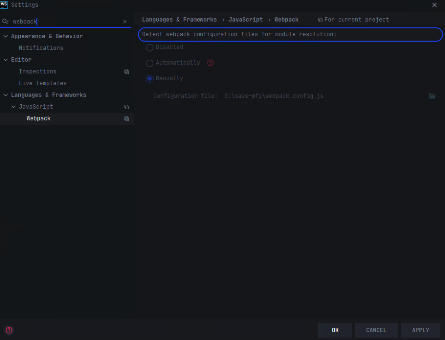

프로젝트에 vue.js를 추가하는 방법에는 기본적으로 세가지가 있습니다.

1. CDN패키지로 사용하기
2. npm을 사용하여 설치
3. CLI를 이용하여 설치

이 중 3번 CLI를 이용하여 설치하는것으로 진행할 예정입니다. 빠르고 쉽게 환경을 구성할 수 있으며, 없이 진행 해본 결과 공식문서 설명이 부족한 걸로 보아 CLI로 설치하는 것을 권장 하는거 같습니다. CLI 없이 설치 해보면서 있었던 문제  및  해결 방법을 뒷쪽에 추가로 이야기 하겠습니다.

## 1. CLI Install

먼저 vue3를 설치하기 위해서는 vue CLI  버전이 4.5버전 이상이어야 하기 때문에,  CLI가 설치되어있지 않거나 버전이 낮으신 분은 CLI를 전역에 설치를 먼저 해주어야 합니다.(어디서든 CLI 명령어를 사용하기 위해서 전역으로 설치해주는것이 좋다)

```bash
npm install -g @vue/cli
```

노드버전이 낮을경우 안 될수 있다고 하니 잘 안될 경우 이참에 node랑 npm버전을 올려보는 것도 좋을거 같습니다.(참고로 제 노드버전은 12.18.3 npm 버전은 6.12.1입니다.)

## 2. 프로젝트 만들기

뷰 프로젝트 만들고 싶은 위치에서 `vue create` 프로젝트명 명령어를 치시고 `manulley`를 선택 후 원하는 구성을 하면 됩니다.

```bash
vue create 프로젝트명
```

```bash
> manually select features 
[*]Choose Vue version
[*]Babel  // js 최신 문법을 폴리필 해줘 구형 브라우저 동작하게 해주는 컴파일러
[]TypeScript // 정적타입 언어
[]Progressive Web App (PWA) Support
[*]Router 
[*]Vuex // 상태 관리 라이브러리
[*]CSS Pre-processors // scss, less등 전처리 필요한 css 사용시 선택
[*]Linter / Formatter // ESLint, prettier등 사용시 선택
[*]Unit Testing // 단위테스도구 사용시 선택 (jest, Mocha + Chai)
[]E2E Testing

Choose a version of Vue.js that you want to start the project with:
(o) 3.x (Preview)

Use history mode for router?
Y

Pick a CSS pre-processor:
Sass/SCSS (with node-sass)

Pick a linter / formatter config:
ESLint with error prevention only  // airbnb 등 선택가능하지만 직접 룰 설정시 선택

Pick additional lint features:
(o) Lint on save
( ) Lint and fix on commit

Pick a unit testing solution
(o) jest
( ) Mocha + Chai

Where do you prefer placing config for Babel, ESLint, etc.?
> In dedicated config files   // 설정파일 별도 관리
  In package.json             // 패키지.json 파일에서 관리

Save this as a preset for future projects?
N
```

대략적으로 위와같이 진행하면 뷰 프로젝트가 생성됩니다.

## 3. 프로젝트 실행

CLI를 통해 설치하게 되면 기본적으로 웹팩이 포함 되어있고, npm run server를 하게 되면 8080포트로 webpack-server가 올라가게 됩니다.

- package.json에 scripts 프로퍼티에는 vue-cli-service-serve를 실행시킨는것을 확인 할 수있다.
- 번들은 웹팩을 이용하여 진행된다.
- 개발서버는 webpack-dev-server를 이용한다.

```bash
npm run serve
```
## 4. 설정

추가적인 개발환경을 진행하면서 하게된 설정들을 공유하겠습니다.

- jest
- eslint
- stylelint
- webstorm

### 1) 뷰 설정

기본적으로 cli에 포함 되어 있는 webpack이나 webpack-dev-server 설정을 변경하고 싶다면 `vue.config.js` 파일을 만들고 수정하여야 한다.

- cli로 설치하게 되면 `@` 는 프로젝트 root의 src폴더를 바라보게 설정되어 있다.
- webpack 설정을 변경하고 싶을시 [conigureWebpack](https://cli.vuejs.org/guide/webpack.html#simple-configuration)(webpack-merge를 이용하여 병합), [chainWebpack](https://cli.vuejs.org/guide/webpack.html#chaining-advanced)(체이닝을 이용하여 옵션 변경 추가) 옵션을 이용하여 변경 할 수 있습니다.

```jsx
/* vue.config.js */
module.exports = {
  devServer: {
    hot: true, // 핫 리로드 설정
    overlay: false, // 코드에 에러시 웹페이지 에러가 표시되는 부분 제거
  },
	configureWebpack: require('./webpack.config.js'), // 웹팩 설정을 별도 파일로 분리
};
```

```jsx
/* webpack.config.js*/
const path = require('path');
const StyleLintPlugin = require('stylelint-webpack-plugin');

const resolve = (dir) => path.join(__dirname, dir);
module.exports = {
  resolve: {
    alias: {
      main: resolve('src'), // 추가 alias 설정 
    },
  },
  plugins: [
    new StyleLintPlugin({
      files: ['src/**/*.{vue,scss}'],
      emitError: true,
      emitWarning: true,
      failOnError: false,
      failOnWarning: false,
    }),
  ],
};
```

### 2) 린트 설정

es lint는 airbnb 기반의 커스텀 룰셋을 사용했습니다. 설정은 아래와 같습니다.

```jsx
module.exports = {
  root: true,
  env: {
    node: true,
  },
  extends: [
    'plugin:vue/vue3-recommended',
    'exem', // 추가 Extension Airbnb 룰이나 기타 룰을 사용하면 된다.  
  ],
  settings: {
		// import시 해당 위치에 파일 존재 여부확인 alias설정시 필요 '@' 
    'import/resolver': {
      webpack: {
        config: require.resolve('@vue/cli-service/webpack.config.js'),
      },
    },
  },
  parserOptions: {
    parser: 'babel-eslint',
    sourceType: 'module',
  },
  rules: {
    'no-console': process.env.NODE_ENV === 'production' ? 'warn' : 'off',
    'no-debugger': process.env.NODE_ENV === 'production' ? 'warn' : 'off',
    // import시 파일 확장자 제외 관련 옵션 
		'import/extensions': ['error', 'ignorePackages', { js: 'never', vue: 'never' }],
  },
  overrides: [
    {
      files: [
        '**/__tests__/*.{j,t}s?(x)',
        '**/tests/unit/**/*.spec.{j,t}s?(x)',
      ],
      env: {
        jest: true,
      },
    },
  ],
};
```

린트 설정시 가장 힘들었던 부분은 alias 추가 설정시 해당 부분을 인지 못해 `(import/no-unresolved)` 에러가 발생하는 부분이었습니다.

해당 부분을 처리하기 위해 `eslint-import-resolver-webpack` 라이브러리를 설치 해줬으며, `settings` 옵션을 추가 해줬습니다.(위 참고)

추가로 위와 같이 하여도 동작에는 이상이 없지만 webstorm 자체에서 경로를 인식하지 못하는 문제가 있어, 에러로 보이는 문제가 있었습니다. 해당 부분이 저와 같이 자꾸 눈에 밟히실 경우 아래와 같이 webstorm 설정을 해주시면 해결 할 수 있습니다.

webstorm → settings → webpack → manually 선택 후 webpack.config.js를 수동으로 선택하면 webstorm에서 경로를 잘 인식해서 에러표시가 안 나는것을 확인 할 수 있다.



### 3) Jest 설정

cli에서 제공하는 유니테스트 툴은 Mocha랑 Jest 입니다.  그 중 Jest를 선택해 설정했습니다.

```jsx
/* jest.config.js */
module.exports = {
  preset: '@vue/cli-plugin-unit-jest',
  transform: {
    '^.+\\.vue$': 'vue-jest',
  },
  testPathIgnorePatterns: [], // 테스트 제외할 것들
  moduleNameMapper: {
    'main/(.*)$': '<rootDir>/src/$1', // 웹팩 alias와 같음
  },
  moduleFileExtensions: ['js', 'vue'], // 확장자 생략
};
```

### 4) StyleLint 설정

- stylelint, stylelint-webpack-plugin  라이브러리 추가
- 웹팩 설정에 스타일린트 로더 추가
- stylelint.config.js  루트에 추가 (웹스톰에서 해당파일을 인지)

```jsx
/* stylelint.config.js */
module.exports = {
  extends: [
    'stylelint-config-exem',  // 스타일린트 extend 추가
  ],
  rules: {
	// 스타일린트 추가 룰 설정
  },
};
```
## 타입스크립트 추가시

타입스크립트를 vue cli에서 선택시 [class-style](https://class-component.vuejs.org/)을 사용할지 여부를 물어보는데, vue3에서는 typescript를 지원하기 때문에 N을 선택 후 사용하시면 됩니다. 

```bash
Use class-style component syntax? // 클래스방식을 사용할지 말지 선택 
N

Use Babel alongside TypeScript(required for modern mode, auto-detected polyfills, transpiling JSX)?
Y
```
